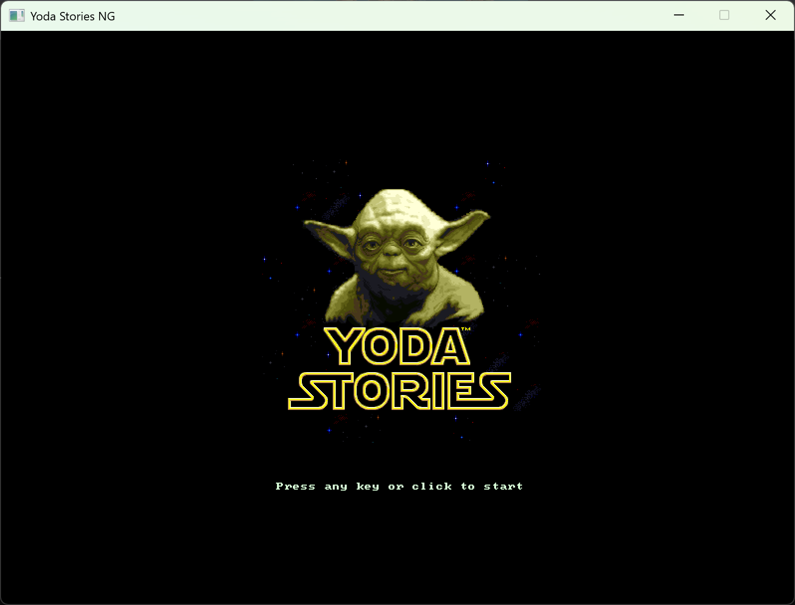
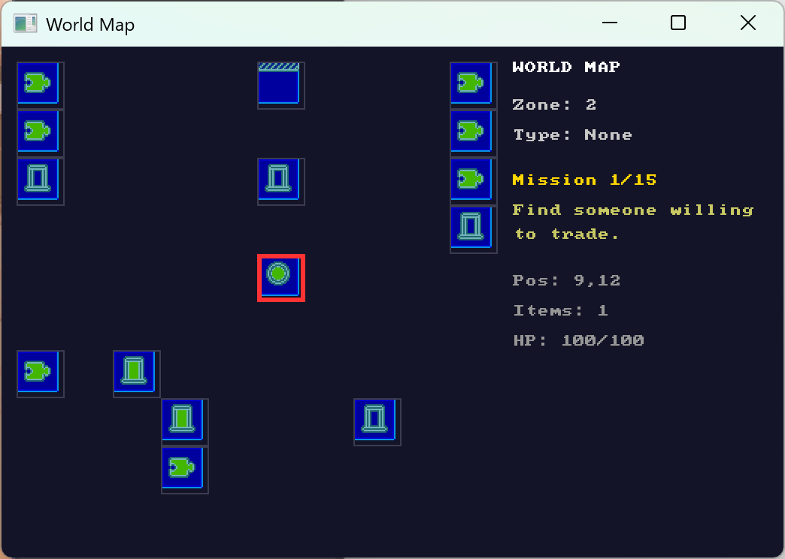
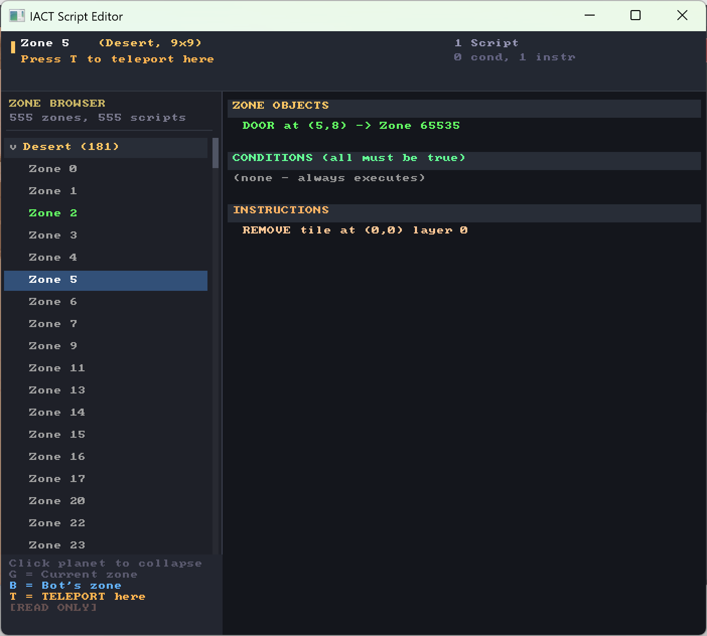
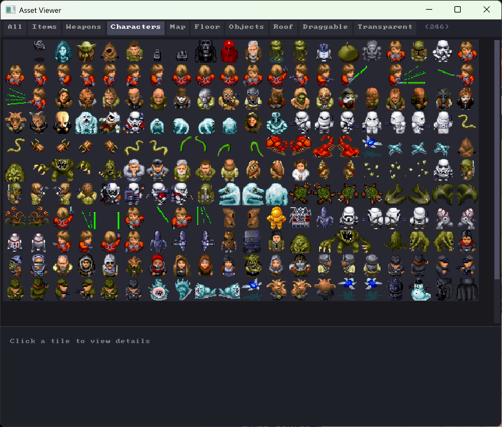

# Yoda Stories NG

A modern reimplementation of **Star Wars: Yoda Stories** (1997) and **Indiana Jones and His Desktop Adventures** (1996) built with C# and SDL2.


## About

Yoda Stories NG is a fan-made recreation of the classic LucasArts Desktop Adventures games. It parses the original game data files and reimplements the game engine from scratch. Both **Star Wars: Yoda Stories** (`YODESK.DTA`) and **Indiana Jones and His Desktop Adventures** (`DESKTOP.DAW`) are supported.



## Key Features

- **Dual game support** - Plays both Yoda Stories (`.dta`) and Indiana Jones (`.daw`) files
- **Complete data file parsing** - Reads original game assets with automatic game type detection
- **Procedural world generation** - Each playthrough generates a unique 10x10 or 15x15 world map
- **15 mission cycle** - Full mission progression with item chains and NPC puzzles
- **Combat system** - Melee and ranged weapons with NPC AI
- **Score system** - Force Factor (Yoda) / Indy Quotient (Indy) end-game scoring
- **Color palette animation** - Authentic animated water, lava, and fire effects
- **R2D2 help system** - Context-sensitive hints from your droid companion
- **Save/Load system** - JSON-based save files with full game state
- **Widescreen UI** - Modern layout with sidebar HUD
- **Xbox controller support** - Full gamepad controls
- **Configurable graphics** - 2x and 4x scaling options
- **Automated Mission Bot** - AI-powered gameplay with A* pathfinding
- **Complete script engine** - All 30+ condition and instruction opcodes implemented

## Screenshots

### Yoda Stories Gameplay


### Indiana Jones Gameplay


### Score Screen (Force Factor)


### Palette Animation (Water/Lava Effects)


### World Map Viewer


### Script Editor


### Asset Viewer


### R2D2 Help System


## Requirements

- .NET 8.0 SDK
- Original game files:
  - Star Wars: Yoda Stories - `YODESK.DTA`
  - Indiana Jones Desktop Adventures - `DESKTOP.DAW` (optional)
- Windows, Linux, or macOS

## Building

```bash
# Clone the repository
git clone https://github.com/yourusername/YodaStoriesNG.git
cd YodaStoriesNG

# Build the project
dotnet build src/YodaStoriesNG.Engine

# Run (make sure yodesk.dta is in the data folder)
dotnet run --project src/YodaStoriesNG.Engine
```

## Controls

### Keyboard

| Key | Action |
|-----|--------|
| **WASD** / **Arrow Keys** | Move |
| **Shift + Direction** | Pull blocks |
| **Space** | Action / Talk / Attack |
| **1-8** | Select inventory slot |
| **Tab** | Toggle weapon |
| **O** | Show mission objective |
| **X** | Travel (X-Wing) |
| **R** | Restart game |
| **M** | Toggle sound mute |
| **Escape** | Quit |

### Debug Controls

| Key | Action |
|-----|--------|
| **F1** | Toggle Debug Overlay |
| **F2** | Toggle Map Viewer |
| **F3** | Toggle Script Editor |
| **F4** | Toggle Asset Viewer |
| **B** | Toggle Mission Bot |
| **I** | Inspect (console dump) |
| **N/P** | Next/Previous zone |
| **F** | Find zone with content |

### Xbox Controller

| Button | Action |
|--------|--------|
| **Left Stick** / **D-Pad** | Move |
| **A** | Action / Talk / Attack |
| **B** | Cancel / Dismiss dialogue |
| **X** | Travel (X-Wing) |
| **Y** | Show mission objective |
| **LB / RB** | Toggle weapon |
| **Start** | Restart game |
| **Back** | Quit |

## Menu System

### File Menu
- **New Game: Small/Medium/Large/X-tra Large** - Start new game with different world sizes
- **Save Game** - Save current progress
- **Load Game** - Load saved game
- **Exit** - Quit the game

### Debug Menu
- **Map Viewer (F2)** - See the full world map with zone types
- **Script Editor (F3)** - View and analyze IACT action scripts
- **Asset Viewer (F4)** - Browse game tiles and characters
- **Enable/Disable Bot** - Toggle automated gameplay

### Config Menu
- **Graphics: 2x/4x Scale** - Change window size and rendering scale
- **Keyboard Controls** - View keyboard control mappings
- **Controller Controls** - View Xbox controller mappings
- **Select Data File** - Choose which .dta file to load

## World Generation

The game generates procedural worlds using the original algorithm:

| Size | Grid | Puzzles | Description |
|------|------|---------|-------------|
| **Small** | 10x10 | 4-8 | Quick adventure |
| **Medium** | 10x10 | 6-12 | Standard game |
| **Large** | 10x10 | 8-16 | Extended quest |
| **X-tra Large** | 15x15 | 12-24 | Epic journey |

### Yoda Stories Worlds
- **Spaceport** - Landing zone with X-Wing for travel
- **Puzzle zones** - Contain items and NPCs for trading
- **Blockades** - Require specific items to pass
- **Travel zones** - X-Wing connections to islands
- **Islands** - Remote areas (Dagobah) with special puzzles
- **The Force** - Guaranteed lightsaber at distance 2 from start

### Indiana Jones Worlds
- **Home Base** - Starting location (no vehicle)
- **Puzzle zones** - Artifacts and NPC traders
- **Blockades** - Obstacles requiring items to pass
- **Travel zones** - Vehicle/boat connections
- **Remote areas** - Temples and dig sites
- **Weapon cache** - Guaranteed weapon near start

## Score System

Upon completing 15 missions, you receive a score evaluation:

### Force Factor (Yoda Stories) / Indy Quotient (Indiana Jones)

| Component | Max Points | Description |
|-----------|------------|-------------|
| **Time Bonus** | 200 | Faster completion = more points |
| **Puzzles Solved** | 100 | Percentage of puzzles completed |
| **Difficulty** | 100 | Based on puzzle complexity |
| **Exploration** | 100 | Zones visited vs world size |

### Ratings

| Score | Force Factor (Yoda) | Indy Quotient (Indy) |
|-------|---------------------|----------------------|
| 450+ | Legendary Hero! | Master Archaeologist! |
| 400-449 | Jedi Master | Professor of Antiquities |
| 350-399 | Jedi Knight | Seasoned Explorer |
| 300-349 | Padawan | Field Researcher |
| 250-299 | Force Sensitive | Museum Curator |
| 200-249 | Adventurer | Graduate Student |
| <200 | Beginner | Amateur |

## Debug Tools

### Map Viewer (F2)
Shows the complete world grid with color-coded zones:
- Player position highlighted with pulsing border
- Zone types: Puzzle, Spaceport, Blockade, Travel, Island
- Mission progress and current objective

### Script Editor (F3)
Browse and analyze zone action scripts:
- View IACT conditions and instructions
- Click on referenced positions to highlight in-game
- Teleport to zones for testing

### Asset Viewer
Browse the complete tile atlas:
- All 2000+ game tiles
- Character frames and animations
- Filter by tile type

### Console Inspector (I)
Dumps detailed game state to console:
- Current zone objects and NPCs
- Tile data at player position
- Full IACT script dump
- Inventory and weapon status

## Save System

Games are saved to `%APPDATA%/YodaStoriesNG/saves/` in JSON format.

Save files include:
- Player position, health, inventory
- World map and zone connections
- Mission progress and puzzle state
- All game variables and flags

## Mission Bot

The automated Mission Bot (press **B**) plays the game automatically:

- **A* pathfinding** for optimal movement
- **Auto-combat** with melee and ranged weapons
- **Item collection** from crates and NPCs
- **Puzzle solving** through item trading
- **Zone exploration** to find objectives

The bot displays its current task in the HUD when active.

> **Note:** The Mission Bot is currently optimized for Yoda Stories (X-Wing travel, Dagobah missions). Indiana Jones support is planned for a future update.

## Project Structure

```
YodaStoriesNG/
├── src/
│   └── YodaStoriesNG.Engine/
│       ├── Audio/           # Sound playback
│       ├── Bot/             # Automated mission bot
│       │   ├── MissionBot.cs
│       │   ├── BotActions.cs
│       │   ├── MissionSolver.cs
│       │   └── Pathfinder.cs
│       ├── Data/            # Game data structures
│       ├── Debug/           # Debug tools
│       ├── Game/            # Core game logic
│       │   ├── GameEngine.cs
│       │   ├── GameState.cs
│       │   ├── WorldGenerator.cs
│       │   ├── MapGenerator.cs
│       │   ├── ActionExecutor.cs
│       │   ├── SaveGameManager.cs
│       │   └── NPC.cs
│       ├── Parsing/         # DTA file parser
│       ├── Rendering/       # SDL2 renderer
│       │   ├── GameRenderer.cs
│       │   ├── TileRenderer.cs
│       │   └── BitmapFont.cs
│       └── UI/              # UI components
│           ├── MenuBar.cs
│           ├── TitleScreen.cs
│           ├── ControlsWindow.cs
│           ├── DebugMapWindow.cs
│           ├── ScriptEditorWindow.cs
│           ├── AssetViewerWindow.cs
│           └── ScoreWindow.cs
└── README.md
```

## Technical Details

### Data Format

The game parses the proprietary `.dta` format:

| Section | Description |
|---------|-------------|
| **TILE** | 32x32 pixel tiles with palette indices |
| **ZONE** | Map data with 3 tile layers (18x18 or 9x9) |
| **CHAR** | Character definitions and walk frames |
| **PUZ2** | Puzzle definitions for quest chains |
| **IACT** | Action scripts (conditions + instructions) |
| **IZAX** | Zone auxiliary data (NPC spawns with items) |
| **STUP** | Title screen image (288x288) |

### Palette Animation

The game features authentic color cycling animation for environmental effects:

| Effect | Speed | Description |
|--------|-------|-------------|
| Water | Fast (150ms) | Blue shimmer in lakes and oceans |
| Lava | Fast (150ms) | Red/orange fire and volcanic effects |
| Forest | Slow (300ms) | Subtle foliage color shifts |
| Ice | Fast (150ms) | Sparkle effects on snow/ice |

Different palette cycles are used for Yoda Stories vs Indiana Jones.

### Action Scripts (IACT)

Zone behavior is driven by IACT scripts. All 30+ opcodes are fully implemented.

**Conditions (25 opcodes):**
- `ZoneEntered`, `ZoneNotInitialized` - Zone entry triggers
- `HasItem`, `RequiredItemIs`, `FindItemIs` - Inventory checks
- `NpcIs`, `HasNpc`, `MonsterIsDead` - NPC state checks
- `TileAtIs`, `Standing`, `HeroIsAt`, `Bump` - Position checks
- `CounterIs`, `RandomIs`, `SectorCounterIs` - Variable checks
- `HealthIsLessThan`, `GamesWonIs`, `ZoneIsSolved` - Game state checks

**Instructions (25 opcodes):**
- `PlaceTile`, `RemoveTile`, `MoveTile`, `DrawTile` - Map manipulation
- `AddItem`, `RemoveItem`, `DropItem` - Inventory management
- `SpeakHero`, `SpeakNpc`, `PlaySound` - Dialogue and audio
- `MoveHeroTo`, `MoveHeroBy`, `ChangeZone` - Player movement
- `EnableMonster`, `DisableMonster`, `EnableHotspot` - Entity control
- `MarkAsSolved`, `WinGame`, `LoseGame` - Game flow
- `SetCounter`, `RollDice`, `AddHealth` - Game variables

## Contributing

Contributions are welcome! Please feel free to submit issues and pull requests.

## Legal

This is a fan project and is not affiliated with or endorsed by LucasArts, Disney, or any related entities. Star Wars and Yoda Stories are trademarks of Lucasfilm Ltd.

You must own a legal copy of Star Wars: Yoda Stories to use this software.

## Acknowledgments

- [WebFun.io](https://www.webfun.io/) - Yoda Stories file format documentation and reference implementation
- The SDL2 team for the cross-platform multimedia library
- LucasArts for creating the original game

---

*May the Force be with you!*
