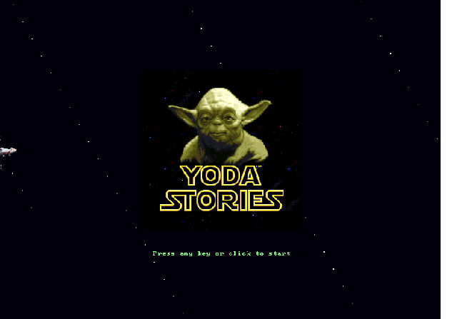
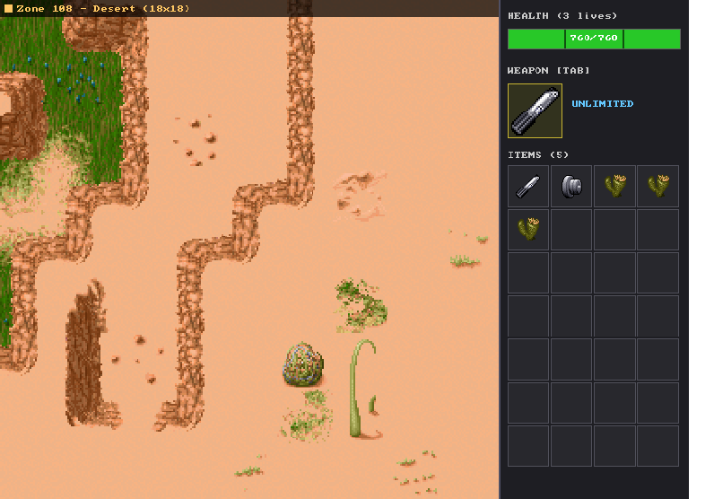
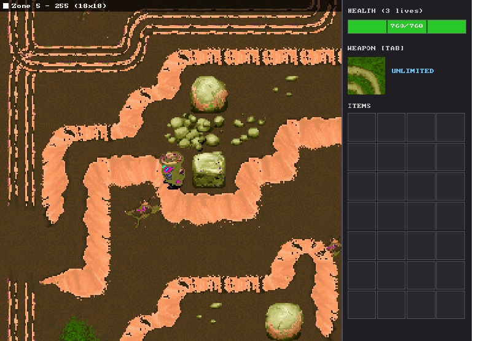
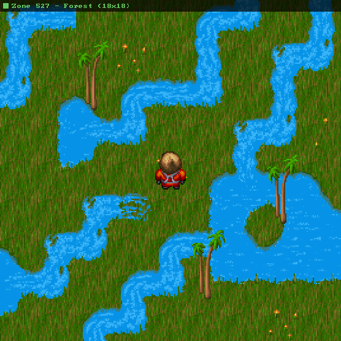

# YODA STORIES NG

[](https://github.com/sp00nznet/YodaStoriesNG/actions/workflows/build.yml)
[](https://github.com/sp00nznet/YodaStoriesNG/releases/latest)

**The 1997 LucasArts desktop toy, rebuilt from its own data file.** Point it at a copy of
*Star Wars: Yoda Stories* or *Indiana Jones and His Desktop Adventures* and it parses the
original tiles, zones, characters and scripts and plays the game - no original executable,
no emulation, no assets in this repository.



*The title screen, rendered from `STUP` in the data file, with the X-Wing flyby assembled at
runtime from tiles 948-951.*

---

## The one reason it exists

**Desktop Adventures generates a new, always-solvable adventure every time you start it**,
and it did that in 1996 in under five megabytes. That generator is the interesting artefact,
and it is locked inside a proprietary container no modern tool reads.

So the point is not nostalgia. It is that `YODESK.DTA` contains a complete procedural
adventure system - a puzzle table, a sector-growth algorithm, and a thirty-eight-opcode
scripting language - and reading it back out is the only way to see how it works.

| | |
|---|---|
|  |  |
| **Yoda Stories** - Tatooine, generated | **Indiana Jones** - same engine, its own palette |

## Where it is

**Yoda Stories is playable end to end.** Fifteen missions, procedural worlds at four sizes,
item-chain puzzles, combat, scoring, save and load. All 36 condition and 38 instruction
opcodes are implemented.

**Indiana Jones parses, renders and plays, but generates no mission chain** - the world
generator is still written around Yoda Stories' planet structure, so you get a real world of
real zones with nothing to solve. That is the biggest open item on the
[roadmap](docs/ROADMAP.md).

```
2,123 tiles      658 zones      205 puzzles      8,696 scripts      77 characters
```

## How it works

- **One file is the whole game.** A flat sequence of tagged sections - tiles, zones,
  characters, puzzles, scripts, the title art. Parsed once at startup into plain objects.
  [DATA-FORMAT.md](docs/DATA-FORMAT.md)
- **Zone behaviour is data, not code.** Each zone carries IACT scripts: a flat AND of
  conditions, then a flat sequence of instructions. Doors, traps, trades, teleports and the
  win condition are all built out of that. [SCRIPTING.md](docs/SCRIPTING.md)
- **Worlds grow outward and chain backwards.** A sector grid expands ring by ring from the
  spaceport; then the puzzle chain is built *backwards* from the goal, so the world is
  solvable by construction. [WORLD-GENERATION.md](docs/WORLD-GENERATION.md)
- **The water moves because the palette rotates.** No tile data changes and no textures are
  re-uploaded - named colour ranges rotate within themselves on a 150 ms timer. The two
  games animate different ranges, which is why loading one as the other looks subtly wrong.



## Run it

**Prebuilt, self-contained, no runtime to install:**
[Releases](https://github.com/sp00nznet/YodaStoriesNG/releases) - Windows, Linux, macOS
(Intel and Apple Silicon). You still need your own copy of the game:
[GAME-DATA.md](docs/GAME-DATA.md).

From source, with the .NET 8 SDK ([BUILDING.md](docs/BUILDING.md)):

```bash
git clone https://github.com/sp00nznet/YodaStoriesNG.git
cd YodaStoriesNG

# drop yodesk.dta into Yoda/  (and desktop.daw into INDYDESK/, optionally)
dotnet run --project src/YodaStoriesNG.Engine

# parse and report, without opening a window
dotnet run --project src/YodaStoriesNG.Engine -- --diag

# the one check that matters: the IACT binary layout
dotnet run --project src/YodaStoriesNG.Engine -- --self-test
```

`WASD` to move, `Space` to act, `O` for the objective, `F` to skip to a zone with something
in it, `B` to let the bot play it for you. [PLAYING.md](docs/PLAYING.md) has the rest.

## Look inside it

Six debug tools, all in a normal build - five of them separate windows you can park on a
second monitor. [DEBUG-TOOLS.md](docs/DEBUG-TOOLS.md)

| | |
|---|---|
|  |  |
| **`F3`** IACT disassembly, script coordinates highlighted in the world | **`F4`** all 2,123 tiles, filtered by the flag bits from the file |

`F2` map viewer, `F8` save editor, `F9` zone editor, `F1` in-game overlay, `I` console dump.

## Notes to self

Traps this format sets, each paid for once already:

- **An IACT script item always has five argument slots.** There is no count field. Reading
  slot 0 as a count parses cleanly, shifts every argument by one, and turns dialogue into
  slices of the next section header - and the game still *mostly* runs. `--self-test`
  exists so it cannot come back.
- **The version field does not identify the game.** Retail `DESKTOP.DAW` reports 2.0,
  exactly like Yoda Stories. Trust the file name.
- **`TileAtIs` and `IsVariable` put the tile in slot 0** and the position after it, unlike
  every other tile opcode.
- **The zone count in the `ZONE` header is wrong.** Scan for `IZON` markers instead.
- **Read the backbuffer before `RenderPresent`, not after** - which is why every window
  flushes its own screenshot rather than the game loop doing it centrally.
- **A single-file publish needs `IncludeAllContentForSelfExtract`, not just
  `IncludeNativeLibrariesForSelfExtract`.** Without it the binary parses a data file
  perfectly and then dies on the first SDL call, so "does it start" does not catch it.

## Screenshots

Every image here is generated, never hand-taken:

```powershell
pwsh tools/capture-shots.ps1
```

Two minutes. It builds, plays itself through every screen with the bot, and converts the
frames. [CAPTURING-SCREENSHOTS.md](docs/CAPTURING-SCREENSHOTS.md)

## Layout

```
docs/                     everything needing more than a paragraph - start at docs/README.md
  hero.gif  shots/        generated by tools/capture-shots.ps1, never by hand
src/
  YodaStoriesNG.Engine/     THE GAME - plays both .dta and .daw
    Parsing/DtaParser.cs      the whole file format
    Game/GameEngine.cs        frame loop, input, rules
    Game/WorldGenerator.cs    missions and the backwards puzzle chain
    Game/ActionExecutor.cs    the 74 script opcodes
    Rendering/Palette.cs      256 colours and the animation cycles
    Bot/                      A* mission bot, plays it for you
    UI/                       title screen, HUD, six debug tools
    Dev/                      screenshot harness and the self-test
  IndyNG.Engine/            a minimal .daw parse/palette testbed, not how you play Indy
tools/                    capture harness, SZDD decompressors, palette extractors
```

## Legal

Fan project, not affiliated with or endorsed by LucasArts, Disney or Lucasfilm. Star Wars,
Yoda Stories and Indiana Jones are their trademarks. **No game content is in this
repository** - you must own a legal copy of whichever game you load.

Code is [MIT](LICENSE); see [NOTICE](NOTICE) for what that does and does not cover.
File-format work is cross-checked against
[WebFun](https://codeberg.org/cyco/WebFun), without which several of the notes above would
still be open bugs.

---

*May the Force be with you.*
