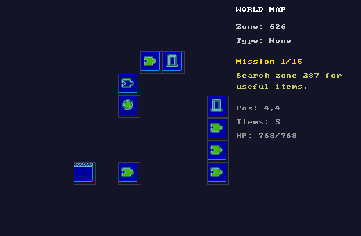
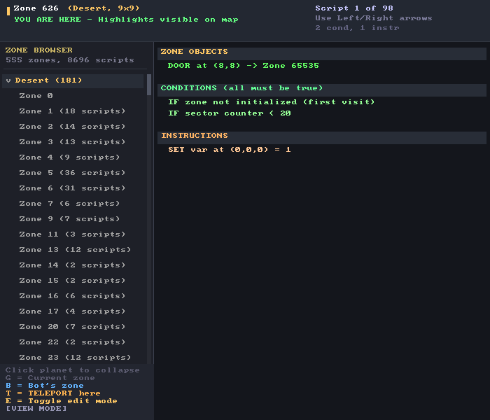
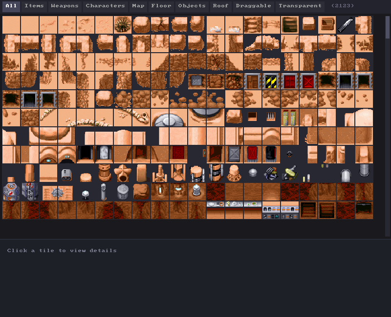

# Debug tools

The engine ships with more inspection surface than most reimplementations, because
reverse-engineering a format is mostly a matter of seeing what you just parsed. Everything
here is available in a normal build - there is no separate debug configuration.

| Key | Tool |
|---|---|
| `F1` | Debug overlay (in-window) |
| `F2` | Map Viewer |
| `F3` | Script Editor |
| `F4` | Asset Viewer |
| `F8` | Save Game Editor |
| `F9` | Zone Editor |
| `B` | Mission bot |
| `I` | Console inspector |
| `F` | Jump to a zone with content |
| `N` / `P` | Next / previous zone |

Every window except the overlay is a **separate OS window** with its own SDL renderer, so
you can put the map on a second monitor and keep playing. They are opened from the keys
above or from the **Debug** menu.

---

## Debug overlay (`F1`)

Drawn inside the game window rather than beside it. Five tabs - **State**, **Zone**,
**Scripts**, **Inventory**, **Map** - selected with left and right arrow, scrolled with up
and down, closed with `Esc` or `F1` again.

The fastest way to answer "what does the engine think is going on right now" without
leaving the game.

---

## Map Viewer (`F2`)

The whole generated world at a glance:

- Every placed sector, colour-coded by type - puzzle, spaceport, blockade, travel, island.
- Your position, marked with a pulsing border.
- The current mission number out of fifteen and its objective text.
- Position, item count and health.

This is the picture that makes [WORLD-GENERATION.md](WORLD-GENERATION.md) make sense. Open
it right after starting a game and you can see the whole solution before you walk it.

---

## Script Editor (`F3`)

The most useful tool in the set, and the one that turns opaque data into something you can
argue with.

- **Zone browser** down the left, grouped by planet, showing each zone's script count.
- **Disassembly** on the right: conditions and instructions in readable form, with tile IDs
  resolved to names and dialogue shown in full.
- **Highlights**: coordinates a script refers to are marked in the game world, so
  `Bump 9,0` becomes a visible square rather than two numbers.
- **`T` teleports** you into the zone you are reading, which is how you check whether a
  script does what you just decided it does.
- **`E` toggles edit mode**; `G` jumps to your zone, `B` to the bot's.

If the disassembly reads like fragments of section names rather than English, the parser is
misaligned - see [SCRIPTING.md](SCRIPTING.md#the-five-argument-trap).

---

## Asset Viewer (`F4`)

Browses all 2,123 tiles, filtered by the flag tabs across the top: **All, Items, Weapons,
Characters, Map, Floor, Objects, Roof, Draggable, Transparent**. Those tabs are exactly the
`TileFlags` bits from the file - see
[DATA-FORMAT.md](DATA-FORMAT.md#tile---the-tile-atlas).

Click a tile for its ID, flags and name. This is how hard-coded IDs like the X-Wing's
948-951 or The Force's 511 were found in the first place.

---

## Save Game Editor (`F8`)

Opens any `.ysng` save from the save directory across five tabs - **Overview, Inventory,
World, Zones, Variables**.

Yellow fields are editable: click one, type, and `Ctrl+S` writes it back. You can move the
player, change health, add items to the inventory, and flip zone variables. `F5` refreshes,
`Esc` closes.

Faster than playing to the state you need to test.

---

## Zone Editor (`F9`)

Visual tile editing for the current zone across its three layers, plus its objects. Changes
are in-memory - this is for understanding zone structure and testing scripts, not for
authoring content that persists.

---

## Console inspector (`I`)

Dumps everything to stdout in one go: game state, current zone, that zone's scripts,
inventory, mission progress and variables. `DebugTools` in
`src/YodaStoriesNG.Engine/Debug/DebugTools.cs` also has entry points for dumping a zone by
ID and for **searching every zone for a given opcode**, which is the quickest way to find
out whether a script feature is used at all.

---

## Zone navigation

| Key | Effect |
|---|---|
| `N` / `P` | Step to the next or previous zone by ID, regardless of the world map. |
| `F` | Jump to the next zone that actually contains NPCs or items, and report what it found. |

`F` is the one to reach for. A freshly generated world has a lot of empty scenery, and `F`
skips straight past it. It is also what the screenshot harness uses to find a zone worth
photographing.

---

## Mission bot (`B`)

An automated player, in `src/YodaStoriesNG.Engine/Bot/` (~2,900 lines across four files).

| File | Responsibility |
|---|---|
| `MissionSolver.cs` | Decides what to do next: which item is needed, which zone has it, what to do when it gets there. |
| `MissionBot.cs` | Turns that decision into a sequence of concrete actions. |
| `BotActions.cs` | Executes one action - walk here, talk to that, pick that up. |
| `Pathfinder.cs` | A* over the zone's walkable tiles. |

It handles combat, item collection, item-trade puzzles, zone exploration, and the R2-D2
detour on Dagobah. Its current task shows in the HUD while it runs.

The bot drives the engine through the same entry points a player's keypresses do, which
keeps it honest: if the bot can finish a mission, a player can.

**It only plays Yoda Stories.** Indiana Jones world generation does not produce a mission
chain for it to solve - see [GAME-DATA.md](GAME-DATA.md#indiana-jones-caveats).

The screenshot harness uses the bot to reach a state worth photographing, which is a decent
smoke test in itself: if `tools/capture-shots.ps1` produces a gameplay shot with items in
the inventory, the bot walked, fought and traded to get them.

---

## Related documents

- [CAPTURING-SCREENSHOTS.md](CAPTURING-SCREENSHOTS.md) - driving all of this automatically
- [SCRIPTING.md](SCRIPTING.md) - what the Script Editor is showing you
- [ARCHITECTURE.md](ARCHITECTURE.md#the-frame-loop) - why the tool windows are separate windows
