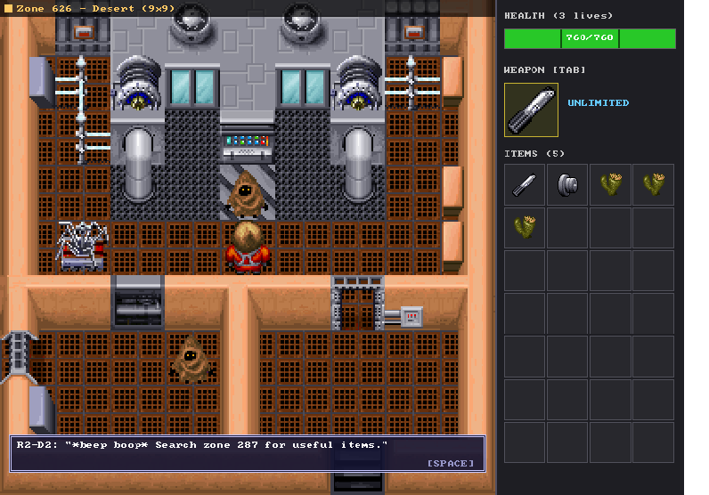
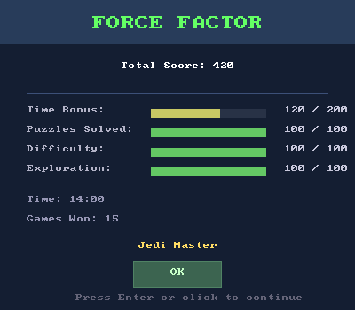
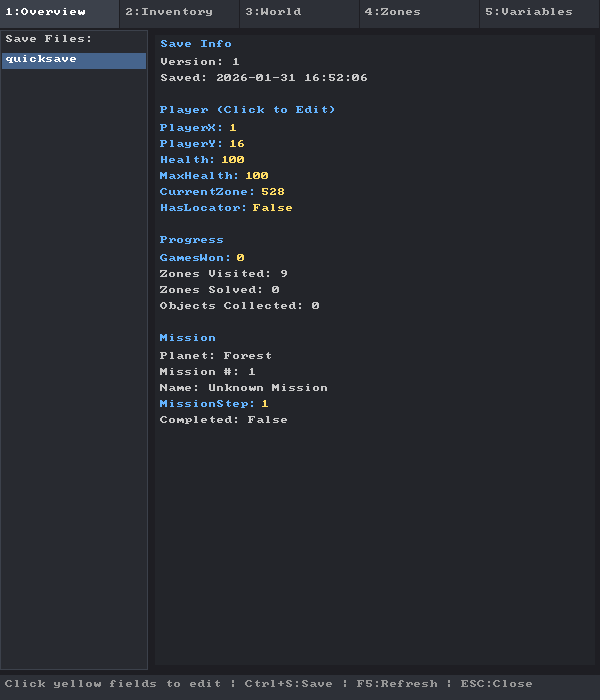

# Playing

A guide to the game as this engine implements it: how to control it, what the fifteen
missions are, how scoring works, and where your saves go.

If you have never played a Desktop Adventure: it is a small top-down action-adventure that
generates a fresh world every time. You wander a grid of screens, solve item-trade puzzles
with the people you meet, hit things that need hitting, and finish a mission. Then it
generates another one.

---

## Your first game, step by step

1. **Start it.** `dotnet run --project src/YodaStoriesNG.Engine`
2. **Dismiss the title screen.** Any key, or click.
3. **Look at the sidebar on the right.** Health at the top, current weapon in the middle,
   your eight-by-seven inventory grid below. It is empty. It will not stay empty.
4. **Press `O`.** The current objective prints as a message - what you are looking for and
   roughly where.
5. **Walk.** `WASD` or the arrow keys. One tap is one tile.
6. **Press `F` if the zone is dull.** It jumps you to the next zone that actually has NPCs
   or items in it. This is a debug shortcut, and it is the fastest way to see the game
   working.
7. **Walk into a person to talk to them.** They will tell you what they want. If you have
   it, they trade. That trade is the puzzle.
8. **Press `Space` to use the selected item or swing the selected weapon.** Direction
   comes from the way you are facing.
9. **Press `1`-`8` to pick an inventory slot**, or click a slot directly. Mouse wheel over
   the sidebar scrolls a long inventory.
10. **Find the X-Wing and press `X`** to travel between the starting swamp and the mission
    planet. Indiana Jones uses a different vehicle in the same role.
11. **Stuck?** Press `O` again, or - once you have the R2-D2 locator droid - let R2 tell
    you where to go next.

---

## Keyboard

### Playing

| Key | Action |
|---|---|
| `W` `A` `S` `D` / arrow keys | Move one tile. Walking into a pushable block pushes it. |
| `Shift` + direction | Pull a block instead of pushing it. |
| `Space` | Use the selected item, talk to whoever is in front of you, or attack. |
| `Tab` | Cycle to the next weapon. |
| `1`-`9`, `0` | Select inventory slot 1-10, relative to the current scroll position. |
| `[` / `]` , `PgUp` / `PgDn` | Scroll the inventory list. |
| `O` | Print the current mission objective. |
| `X` | Board the X-Wing and travel. Only works where a vehicle is parked. |
| `M` | Mute or unmute sound. |
| `R` | Abandon this world and generate a new one. |
| `Esc` | Quit. |

### Debug and tools

| Key | Action |
|---|---|
| `F1` | Debug overlay (arrow keys change tab and scroll, `Esc` closes). |
| `F2` | Map Viewer window. |
| `F3` | Script Editor window. |
| `F4` | Asset Viewer window. |
| `F5` / `F6` / `F7` | Window scale 1x / 2x / 4x. |
| `F8` | Save Game Editor window. |
| `F9` | Zone Editor window. |
| `B` | Toggle the mission bot - it plays for you. |
| `F` | Jump to the next zone containing NPCs or items. |
| `N` / `P` | Next / previous zone by ID. |
| `I` | Dump the full game state to the console. |

All of these are covered in detail in [DEBUG-TOOLS.md](DEBUG-TOOLS.md).

Bindings are stored in `%APPDATA%/YodaStoriesNG/keybindings.json`
(`~/.config/YodaStoriesNG/` on Linux and macOS) and can be edited there.

---

## Controller

Any SDL2-recognised gamepad works; the layout is written for an Xbox pad. Plug it in at any
time - the engine picks it up and says so on screen.

| Input | Action |
|---|---|
| D-pad | Move |
| Left stick | Move (analogue, repeats while held) |
| `A` | Use item / talk / attack |
| `B` | Dismiss dialogue |
| `X` | Travel |
| `Y` | Show objective |
| `LB` / `RB` | Cycle weapon |
| `Start` | New game |
| `Back` | Quit |

There is no controller binding for the debug tools. Use the keyboard.

---

## The menu bar

On Windows the game gets a real native menu bar, drawn by the OS at the correct DPI.

| Menu | Contents |
|---|---|
| **File** | New Game at each of the four world sizes; Save Game; Save As...; Load Game; Exit |
| **Debug** | Asset Viewer (F4), Script Editor (F3), Map Viewer (F2), Save Editor (F8), Zone Editor (F9), Enable/Disable Bot |
| **Config** | Graphics scale 1x/2x/4x, Keyboard Controls, Controller Controls, Select Data File... |
| **About** | About, High Scores |

**On Linux and macOS there is no menu bar.** It is a Win32 construct
(`src/YodaStoriesNG.Engine/UI/NativeMenuBar.cs`) and the engine skips it rather than
crashing. Every item has a keyboard equivalent except Save Game, Save As, Load Game and
Select Data File, which have no shortcut yet - so on those platforms, pass the data file
as an argument (`./YodaStoriesNG.Engine /path/to/YODESK.DTA`) and treat a session as
unsaveable until [#2](https://github.com/sp00nznet/YodaStoriesNG/issues/2) lands.

The data file itself is found case-insensitively, so `YODESK.DTA` straight off the disc
works on a case-sensitive filesystem.

---

## World sizes

Chosen from **File → New Game**. Size changes the grid, the number of puzzles you must
chain together, and the scoring curve.

| Size | Grid | Puzzles | Feel |
|---|---|---|---|
| Small | 10x10 | 4-8 | Twenty minutes. |
| Medium | 10x10 | 6-12 | The default. |
| Large | 10x10 | 8-16 | A proper session. |
| X-tra Large | 15x15 | 12-24 | All fifteen missions on one map. |

How that grid becomes a world is [WORLD-GENERATION.md](WORLD-GENERATION.md).

---

## The fifteen-mission cycle

A full run is fifteen missions. Each one picks a goal puzzle from the game's puzzle table,
works backwards to build a chain of item trades that reaches it, and scatters that chain
across the world. Finishing a mission advances a counter that persists across new worlds
until you complete all fifteen, at which point you get scored.

Missions are drawn without replacement, so a full cycle shows you fifteen distinct goals
rather than the same three repeatedly.

---

## Scoring

At the end of fifteen missions you get a **Force Factor** (Yoda Stories) or **Indy
Quotient** (Indiana Jones) out of 500, from four components:

| Component | Max | How it is earned |
|---|---|---|
| Time Bonus | 200 | Full marks under `5 x world-size-number` minutes, then -20 per further minute. Medium gives you 10 free minutes. |
| Puzzles Solved | 100 | Percentage of the world's puzzle sectors you actually solved. |
| Difficulty | 100 | Currently mirrors Puzzles Solved. |
| Exploration | 100 | Zones visited against `world-size-number x 10` expected. |

The exact arithmetic is `GameState.CalculateScore()` in
`src/YodaStoriesNG.Engine/Game/GameState.cs`.

| Score | Yoda Stories | Indiana Jones |
|---|---|---|
| 450+ | Legendary Hero! | Master Archaeologist! |
| 400-449 | Jedi Master | Professor of Antiquities |
| 350-399 | Jedi Knight | Seasoned Explorer |
| 300-349 | Padawan | Field Researcher |
| 250-299 | Force Sensitive | Museum Curator |
| 200-249 | Adventurer | Graduate Student |
| below 200 | Beginner | Amateur |

Scores are kept in `%APPDATA%/YodaStoriesNG/highscores.json` and shown under
**About → High Scores**.

---

## Saving

Saves are JSON, extension `.ysng`, written to:

| Platform | Location |
|---|---|
| Windows | `%APPDATA%\YodaStoriesNG\saves\` |
| Linux | `~/.config/YodaStoriesNG/saves/` |
| macOS | `~/.config/YodaStoriesNG/saves/` |

**File → Save Game** writes `quicksave.ysng`. **Save As...** lets you name it.

A save carries the whole world, not just your position: player state and inventory, the
generated world map and its zone connections, mission progress and the puzzle chain, every
zone variable and counter, and the set of objects you have already collected. Loading a
save restores the world exactly - it does not regenerate it.

Because it is plain JSON you can open a save in any text editor. Or use the built-in editor
(`F8`), which is friendlier and can add items to your inventory - see
[DEBUG-TOOLS.md](DEBUG-TOOLS.md#save-game-editor-f8).

